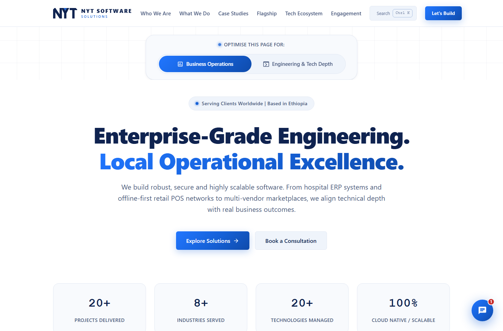
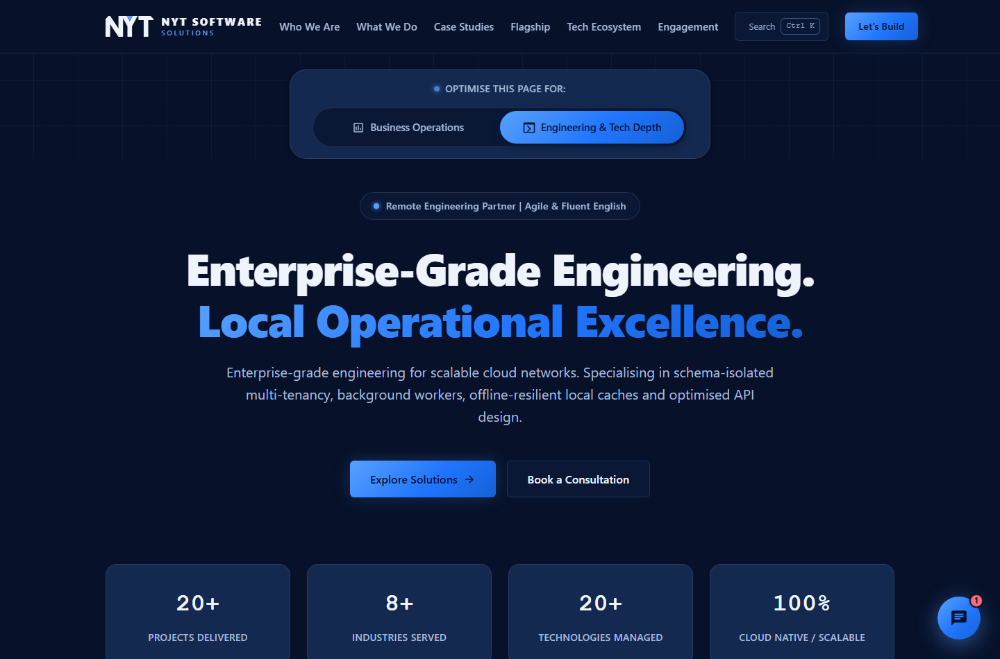

# NYT Software Solutions

> **Enterprise-Grade Engineering. Local Operational Excellence.**
>
> Custom ERPs · Multi-Tenant SaaS · Mobile Apps · Cloud Infrastructure

The official site for NYT Software Solutions — Addis Ababa, Ethiopia, and
remote worldwide. Built with [Astro](https://astro.build), TypeScript and a
hand-written CSS design system derived from the company logo. Ships as a fully
static site with no runtime framework, and works offline.



---

## ⚠️ Read this first: the contact form is not connected

The form **does not send email yet**, and it deliberately does not pretend to.
Until you add an endpoint it validates the input and then hands the visitor a
pre-filled email draft, telling them plainly that it could not deliver the
message itself.

**This is the single highest-value thing to fix.** See
[Wiring up the contact form](#wiring-up-the-contact-form) — it takes about ten
minutes.

---

## Quick start

```bash
npm install
npm run dev          # http://localhost:4321
```

| Command | What it does |
| --- | --- |
| `npm run dev` | Dev server with hot reload |
| `npm run build` | Static build into `dist/` |
| `npm run preview` | Serve the built `dist/` locally |
| `npm run check` | TypeScript + Astro diagnostics |
| `npm run smoke` | Browser interaction tests (needs `preview` running) |
| `npm run a11y` | axe-core accessibility audit (needs `preview` running) |
| `npm run csp` | Loads the site under the production CSP and reports violations |
| `npm run og` | Regenerate the social card and app icons |

`smoke` and `a11y` drive your installed Chrome. If it lives somewhere unusual,
set `CHROME_PATH`.

```bash
# terminal 1
npm run build && npm run preview
# terminal 2
npm run smoke && npm run a11y && npm run csp
```

---

## Wiring up the contact form

Pick any service that accepts a JSON `POST` — [Web3Forms](https://web3forms.com)
is free and needs no account for basic use.

1. Get an access key (Web3Forms emails you one).
2. Open [`src/data/site.ts`](src/data/site.ts) and fill in `formConfig`:

   ```ts
   export const formConfig = {
     endpoint: 'https://api.web3forms.com/submit',
     accessKey: 'your-access-key-here',
   } as const;
   ```

3. **Allow the origin in your Content-Security-Policy**, or the browser will
   block the request. In `netlify.toml` / `vercel.json`, change:

   ```
   connect-src 'self'
   ```
   to
   ```
   connect-src 'self' https://api.web3forms.com
   ```

4. Rebuild and send yourself a test message.

Once `endpoint` is set, the fallback panel disappears and the form posts for
real. A failed request reports the failure — it never claims success it did not
get.

---

## Editing content

Almost nothing needs a code change.

| To change… | Edit |
| --- | --- |
| Company name, email, domain, timezone | [`src/data/site.ts`](src/data/site.ts) |
| Nav links, hero stats, persona copy | [`src/data/site.ts`](src/data/site.ts) |
| Case studies | [`src/content/case-studies/*.md`](src/content/case-studies/) |
| Services | [`src/data/services.ts`](src/data/services.ts) |
| Tech stack + filters | [`src/data/tech.ts`](src/data/tech.ts) |
| Process steps, remote services | [`src/data/process.ts`](src/data/process.ts) |
| Engagement models | [`src/data/engagement.ts`](src/data/engagement.ts) |
| FAQ (also feeds Google's FAQ rich result) | [`src/data/faq.ts`](src/data/faq.ts) |
| Testimonials | [`src/data/testimonials.ts`](src/data/testimonials.ts) |
| Chatbot answers | [`src/scripts/chatbot.ts`](src/scripts/chatbot.ts) |

### Adding a case study

Drop a new `.md` file into `src/content/case-studies/`. The schema in
[`src/content.config.ts`](src/content.config.ts) is enforced at build time, so a
missing field fails the build rather than shipping a broken card. The new entry
automatically appears in the grid **and** in the ⌘K command palette.

Every metric has an optional `source` field. Use it. An unattributed "85%" reads
as marketing; "reported by the client after the first quarter" reads as fact.

### Testimonials

They are currently attributed to companies. A named person with a job title is
substantially more persuasive — as clients approve, fill in the `person` field:

```ts
person: { name: 'Abebe Bekele', role: 'Operations Manager' },
```

---

## What's in here

```
src/
├── content/case-studies/   Case studies as markdown (typed frontmatter)
├── data/                   All editable copy and config
├── components/             Astro components
├── layouts/Base.astro      <head>, SEO, JSON-LD, no-flash persona script
├── scripts/                Interaction modules (TypeScript)
├── styles/                 Design system — see styles/index.css for load order
└── pages/                  index, 404, offline
public/                     favicon, icons, og-image, manifest, sw.js, robots
scripts/                    Build + test tooling (og, smoke, a11y)
```

### The brand system

Everything derives from the two colours in the logo:

| | | |
| --- | --- | --- |
| Navy | `#0F2350` | the letterforms and the wordmark |
| Blue | `#2176FF` | the triangle in the Y, and "SOLUTIONS" |

The logo itself is drawn as geometry, not set in a typeface — see
[`Logo.astro`](src/components/Logo.astro). N, Y and T are entirely
straight-edged, so they reproduce exactly as SVG polygons: crisp at any size,
recoloured by the theme, and the source for the favicon and social card too
(`npm run og`).

Design language taken from the mark: hard corners rather than pills, the
downward triangle reused as a motif, and letter-spaced uppercase labels
flanked by rules.

### The intro splash

The loader is a **deliberate hold**, not a measurement of load time — the site
itself is interactive in well under a second. Timings live in
[`src/data/site.ts`](src/data/site.ts):

```ts
export const loader = {
  minMs: 5000,   // stay up at least this long, even when ready sooner
  maxMs: 7000,   // hard ceiling — a stalled asset can never strand a visitor
};
```

The progress bar is driven from `minMs`, so it tracks the real wait instead of
filling early and sitting at 100%. Any click or keypress skips the remainder,
and `prefers-reduced-motion` bypasses it entirely.

> **Worth knowing:** a multi-second gate in front of the content is a
> well-documented driver of bounce rate, and this is a lead-generation page.
> Set `minMs: 0` to show the page as soon as it is ready.

### The persona switcher

The signature interaction, and now the thing that carries the brand's two
halves. It does not swap a hue — it swaps the **entire theme**:

| | Business Operations | Engineering & Tech Depth |
| --- | --- | --- |
| Ground | White | The brand navy |
| Type | Navy on white | White on navy |
| Register | Corporate vendor | Technical / IDE |

Both are the same identity: the light view uses navy as ink, the dark view
uses it as ground. Copy, accent and every case-study card's default tab
change with it. The choice persists in `localStorage`, and an inline script in
`<head>` applies it before first paint so there is no flash of the wrong theme.



Inverted regions (the footer in the light theme, any `.panel-deep`) redefine
the colour tokens on their own subtree, so anything dropped inside them
inherits correct contrast automatically rather than needing per-element
overrides.

### Architecture diagrams

Each case study's Technical Depth tab includes an inline SVG schematic of the
system described. They are diagrams of the real design — not screenshots and
not stock art — because "schema-isolated multi-tenancy" means nothing to a
reader until they can see its shape. See
[`src/components/ArchDiagram.astro`](src/components/ArchDiagram.astro).

### Offline support

`public/sw.js` registers a service worker: network-first for pages,
stale-while-revalidate for assets, with a dedicated `/offline` page. A site that
sells offline-first POS systems ought to survive a dropped connection itself.

---

## Quality gates

| Gate | Status |
| --- | --- |
| `astro check` | 0 errors |
| `npm run smoke` | 36/36 interaction checks |
| `npm run a11y` | 0 serious/critical axe violations across 6 scenarios |
| `npm run csp` | 0 violations under the production Content-Security-Policy |
| JS shipped | ~30 kB (~12 kB gzipped), no runtime framework |

The a11y audit covers both personas, the chat assistant, the command palette
and mobile with the menu open — the states where ARIA problems usually hide.

---

## Deploying

Static output, so anything works. Configs for the two common hosts are
included, both with security headers (HSTS, CSP, `X-Frame-Options`,
`Permissions-Policy`) and immutable caching for hashed assets.

- **Netlify** — [`netlify.toml`](netlify.toml); connect the repo, done.
- **Vercel** — [`vercel.json`](vercel.json); framework auto-detects as Astro.
- **Anything else** — `npm run build`, serve `dist/`.

### After you attach the real domain

1. Set `site` in [`astro.config.mjs`](astro.config.mjs) and `site.url` in
   [`src/data/site.ts`](src/data/site.ts).
2. Update the `Sitemap:` line in [`public/robots.txt`](public/robots.txt).
3. Rebuild — canonical URLs, Open Graph URLs and the sitemap all follow.
4. Replace the LinkedIn and website placeholders in the contact panel
   ([`src/components/Contact.astro`](src/components/Contact.astro)).

---

## Live production case studies

| System | Live | What it does |
| --- | --- | --- |
| Fikrekun Spagna | [Open](https://fikrekunspagna22a.vanguardxie.com/login) | Multi-tenant restaurant & butchery POS with offline-first ordering. Demo: `guest@nyt.com` / `guest123` |
| Saron Orthopedic Center | [Open](https://api.saronorthopediccenter.com) | Clinical records, appointments and billing with role-gated access |
| Bora Amusement Park | [Open](https://boraticketing.vercel.app/) | QR ticketing, 5,000+ daily gate validations |
| Merkato88 | [Open](https://merkato88.com/) | Multi-vendor marketplace, 150+ local merchants |

---

## Contact

- **Email** — [nytsoftwaresolutionplc@gmail.com](mailto:nytsoftwaresolutionplc@gmail.com)
- **GitHub** — [github.com/Nat1-Y](https://github.com/Nat1-Y)
- **Based in** — Addis Ababa, Ethiopia (UTC+3), available for remote contracts
