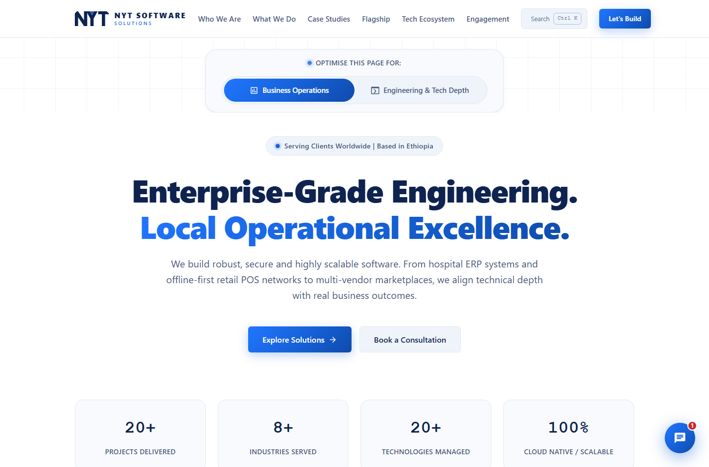
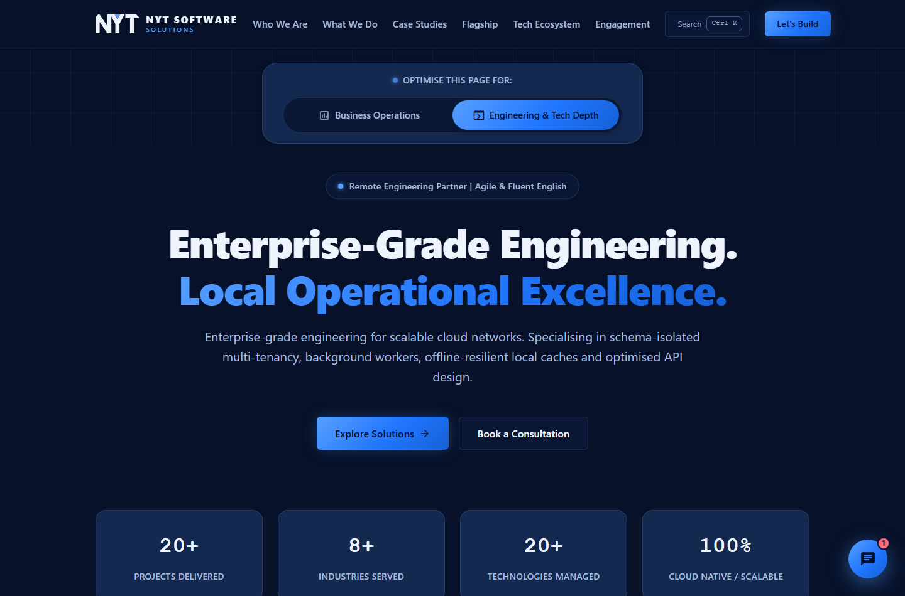
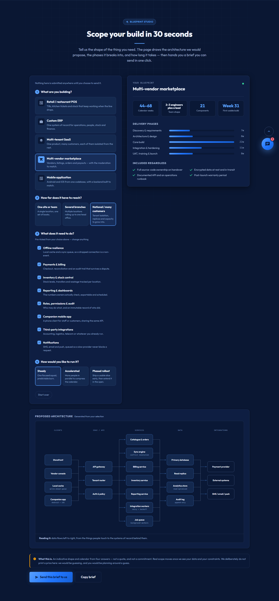

# NYT Software Solutions

> **Enterprise-Grade Engineering. Local Operational Excellence.**
>
> Custom ERPs · Multi-Tenant SaaS · Mobile Apps · Cloud Infrastructure

The official site for NYT Software Solutions — Addis Ababa, Ethiopia, and
remote worldwide. Built with [Astro](https://astro.build), TypeScript and a
hand-written CSS design system derived from the company logo. Ships as a fully
static site with no runtime framework, and works offline.



---

## ⚠️ Read this first: two things only the company can finish

1. **Switch on email delivery.** The contact form posts to the site's own
   function (`api/contact.js`), which delivers through
   [Resend](https://resend.com). Until its keys are set in Vercel, the form
   says it could not send and hands the visitor a pre-filled email draft — it
   never claims a delivery that did not happen. See
   [Contact form](#contact-form).
2. **Work through [docs/claims-register.md](docs/claims-register.md)** — every
   figure on the site, where it comes from, what still needs confirming, and
   the owner actions (rotating a published demo password, testimonial
   permissions, the LinkedIn page, legal review).

---

## Quick start

```bash
npm install
npm run dev          # http://localhost:4321
```

| Command | What it does |
| --- | --- |
| `npm run dev` | Dev server with hot reload |
| `npm run build` | Static build into `dist/` |
| `npm run preview` | Serve the built `dist/` locally |
| `npm run check` | TypeScript + Astro diagnostics |
| `npm test` | Contact endpoint unit tests (no network, no real email) |
| `npm run e2e:form` | The contact form end to end in a browser, against a fake email provider (needs `build`) |
| `npm run smoke` | Browser interaction tests (needs `preview` running) |
| `npm run a11y` | axe-core accessibility audit, home and every inner page (needs `preview`) |
| `npm run csp` | Loads the site under the production CSP and reports violations |
| `npm run links` | Checks every internal link and anchor in `dist/`; add `-- --external` to fetch outbound links too |
| `npm run og` | Regenerate the social card and app icons |
| `npm run captures` | Re-shoot the live client screenshots (see [Images](#images)) |
| `npm run fonts` | Re-download the self-hosted font subsets |

`smoke` and `a11y` drive your installed Chrome. If it lives somewhere unusual,
set `CHROME_PATH`.

```bash
# terminal 1
npm run build && npm run preview
# terminal 2
npm test && npm run e2e:form && npm run links
npm run smoke && npm run a11y && npm run csp
```

---

## Contact form

The form posts JSON to `/api/contact` — a Vercel function in
[`api/contact.js`](api/contact.js), with its logic in
[`api/_lib/enquiry.js`](api/_lib/enquiry.js). It:

- validates and cleans every field on the server (lengths, email shape, options
  from a fixed list, no line breaks in single-line fields);
- rejects bots — a hidden honeypot field, a minimum time to fill the form, an
  origin check, a 20 kB body cap — and rate-limits each IP to five enquiries per
  ten minutes (in memory, per function instance: it stops one client flooding
  the form, not a distributed attack);
- sends the enquiry to the company with **Reply-To** set to the visitor, then a
  confirmation copy to the visitor;
- reports success **only** when Resend accepts the enquiry and returns a
  message id. A refused or failed send is reported as a failure, and the visitor
  gets a pre-filled email draft instead.

The API key lives only in Vercel's environment variables — never in the page.

### Switching it on

1. Create a [Resend](https://resend.com) account and an API key.
2. In Resend, verify the domain you will send from (it gives you DNS records to
   add to `nytsoftwaresolution.pro.et`).
3. In Vercel → Project → Settings → Environment Variables, set (see
   [`.env.example`](.env.example)):

   | Variable | Value |
   | --- | --- |
   | `RESEND_API_KEY` | the key from step 1 |
   | `CONTACT_FROM` | `NYT Software Solutions <hello@nytsoftwaresolution.pro.et>` |
   | `CONTACT_TO` | optional — defaults to the company Gmail address |

4. Redeploy, send yourself a test enquiry, and check both emails arrive.

No CSP change is needed: the form posts to the site's own origin.

**Testing it.** `npm test` covers every server path with a fake provider;
`npm run e2e:form` fills the real form in a browser against the real handler
and a fake provider, and checks that the page claims delivery only when the
provider accepts. Neither sends real mail — step 4 above is the only check of
the live provider.

**If you move off Vercel,** `api/contact.js` exports a standard
`Request → Response` handler (`handleContact`); wrap it in the new host's
function format. `netlify.toml` is kept in step with Vercel's headers, but
Netlify would need that wrapper.

---

## Editing content

Almost nothing needs a code change.

| To change… | Edit |
| --- | --- |
| Company name, email, domain, timezone | [`src/data/site.ts`](src/data/site.ts) |
| Nav links, hero stats, persona copy | [`src/data/site.ts`](src/data/site.ts) |
| Case studies | [`src/content/case-studies/*.md`](src/content/case-studies/) |
| Services | [`src/data/services.ts`](src/data/services.ts) |
| Tech stack + filters | [`src/data/tech.ts`](src/data/tech.ts) |
| Process steps, remote services | [`src/data/process.ts`](src/data/process.ts) |
| Engagement models | [`src/data/engagement.ts`](src/data/engagement.ts) |
| Blueprint Studio: systems, modules, scales, phases | [`src/data/blueprint.ts`](src/data/blueprint.ts) |
| FAQ (also feeds Google's FAQ rich result) | [`src/data/faq.ts`](src/data/faq.ts) |
| Testimonials | [`src/data/testimonials.ts`](src/data/testimonials.ts) |
| Chatbot answers | [`src/scripts/chatbot.ts`](src/scripts/chatbot.ts) |
| LinkedIn, phone, team members (hidden until set) | [`src/data/site.ts`](src/data/site.ts) |
| NYT Cafe Manager page | [`src/pages/products/cafe-manager.astro`](src/pages/products/cafe-manager.astro) |
| How we work (for international clients) | [`src/pages/working-with-us.astro`](src/pages/working-with-us.astro) |
| Privacy notice, terms of use | [`src/pages/privacy.astro`](src/pages/privacy.astro), [`src/pages/terms.astro`](src/pages/terms.astro) |

### Adding a case study

Drop a new `.md` file into `src/content/case-studies/`. The schema in
[`src/content.config.ts`](src/content.config.ts) is enforced at build time, so a
missing field fails the build rather than shipping a broken card. The new entry
automatically appears in the grid, in the ⌘K command palette, **and** as its own
page at `/work/<file-name>/` with seven sections: overview, challenge, what was
built, technology, architecture, results and status.

Every study states its `deployment` — `production`, `delivered` or
`prototype` — and the date that was last checked. Give it a `liveUrl` only
if the link works; there is no demo-credential field, on purpose. Demos are
arranged on request, against an isolated environment (see the owner actions in
[docs/claims-register.md](docs/claims-register.md)).

Every metric has an optional `source` field. Use it. An unattributed "85%" reads
as marketing; "reported by the client after the first quarter" reads as fact.

### Testimonials

They are currently attributed to companies. A named person with a job title is
substantially more persuasive — as clients approve, fill in the `person` field:

```ts
person: { name: 'Abebe Bekele', role: 'Operations Manager' },
```

---

## What's in here

```
src/
├── content/case-studies/   Case studies as markdown (typed frontmatter)
├── data/                   All editable copy and config
├── components/             Astro components
├── layouts/Base.astro      <head>, SEO, JSON-LD, no-flash persona script
├── scripts/                Interaction modules (TypeScript)
├── styles/                 Design system — see styles/index.css for load order
└── pages/                  index, 404, offline
public/                     favicon, icons, og-image, manifest, sw.js, robots
scripts/                    Build + test tooling (og, smoke, a11y)
```

### The brand system

Everything derives from the two colours in the logo:

| | | |
| --- | --- | --- |
| Navy | `#0F2350` | the letterforms and the wordmark |
| Blue | `#2176FF` | the triangle in the Y, and "SOLUTIONS" |

The logo itself is drawn as geometry, not set in a typeface — see
[`Logo.astro`](src/components/Logo.astro). N, Y and T are entirely
straight-edged, so they reproduce exactly as SVG polygons: crisp at any size,
recoloured by the theme, and the source for the favicon and social card too
(`npm run og`).

Design language taken from the mark: hard corners rather than pills, the
downward triangle reused as a motif, and letter-spaced uppercase labels
flanked by rules.

### The intro splash

The loader is a **deliberate hold**, not a measurement of load time — the site
itself is interactive in well under a second. Timings live in
[`src/data/site.ts`](src/data/site.ts):

```ts
export const loader = {
  minMs: 5000,   // stay up at least this long, even when ready sooner
  maxMs: 7000,   // hard ceiling — a stalled asset can never strand a visitor
};
```

The progress bar is driven from `minMs`, so it tracks the real wait instead of
filling early and sitting at 100%. Any click or keypress skips the remainder,
and `prefers-reduced-motion` bypasses it entirely.

> **Worth knowing:** a multi-second gate in front of the content is a
> well-documented driver of bounce rate, and this is a lead-generation page.
> Set `minMs: 0` to show the page as soon as it is ready.

### The persona switcher

The signature interaction, and now the thing that carries the brand's two
halves. It does not swap a hue — it swaps the **entire theme**:

| | Business Operations | Engineering & Tech Depth |
| --- | --- | --- |
| Ground | White | The brand navy |
| Type | Navy on white | White on navy |
| Register | Corporate vendor | Technical / IDE |

Both are the same identity: the light view uses navy as ink, the dark view
uses it as ground. Copy, accent and every case-study card's default tab
change with it. The choice persists in `localStorage`, and an inline script in
`<head>` applies it before first paint so there is no flash of the wrong theme.



Inverted regions (the footer in the light theme, any `.panel-deep`) redefine
the colour tokens on their own subtree, so anything dropped inside them
inherits correct contrast automatically rather than needing per-element
overrides.

### The Blueprint Studio



The page's one interactive tool, and the strongest lead qualifier on the site.
A visitor answers four questions — what they are building, how far it has to
reach, what it must do, how they want it run — and the page answers with:

- an **architecture diagram generated from their selection**, laid out from a
  node list rather than hand-drawn, so any combination renders legibly;
- a **phased calendar** split across discovery, design, build, hardening and
  launch;
- a **written brief** they can copy, or drop straight into the contact form
  with one click.

Everything it knows lives in [`src/data/blueprint.ts`](src/data/blueprint.ts):
system types with their base durations, capability modules with the weeks and
the components each adds, scale multipliers, and delivery paces. Adding a new
capability is one object in the `modules` array — the estimate, the diagram and
the brief all pick it up.

**It does not print a price, on purpose.** The tool knows four facts about a
project; that is nowhere near enough to put a number on an invoice, and a
visitor who plans around a guessed figure has been badly served. It gives a
duration *range* — widening with the size of the job, because a twenty-week
estimate is not as knowable as a six-week one — and says plainly on screen that
this is a shape, not a quote. Cost stays a conversation.

The controls are native radios and checkboxes moved off-screen, never
`display: none` — the platform's keyboard behaviour for a radio group is
already correct, and re-implementing it on `<div>`s means owning that
correctness forever. The whole summary sits in one polite live region rather
than four, so ticking a box announces one update instead of interrupting four
times.

### Architecture diagrams

Each case study's Technical Depth tab includes an inline SVG schematic of the
system described. They are diagrams of the real design — not screenshots and
not stock art — because "schema-isolated multi-tenancy" means nothing to a
reader until they can see its shape. See
[`src/components/ArchDiagram.astro`](src/components/ArchDiagram.astro).

### Images

Every image on the page is a **plate** ([`Plate.astro`](src/components/visuals/Plate.astro)):
a figure with a caption line that always says what the image *is* before what
it shows. There are exactly three kinds, and a smoke check fails the build if
any plate is missing its label:

| Label | What it is | Where |
| --- | --- | --- |
| **Live capture** | A genuine screenshot of a client's public screens, with the host and capture date | Bora and Merkato88 case studies |
| **Illustration** | An original line drawing in the page's own ink | Hero, Fikrekun and Saron plates, the Cafe Manager tour, services, process, engagement |
| **Diagram** | A drawing of real structure or arithmetic | Time-zone overlap, "what happens after you write", the architecture diagrams |

There is no stock photography, on purpose: on a page whose argument is "open
the live system and judge for yourself", a photograph of somebody else's
office is the least credible thing it could show. Where a client's system has
no public screens — a POS full of trading figures, a clinical system full of
patients — its plate is a drawing of the workflow, labelled as one.

**The drawings** are inline SVG in [`src/components/visuals/`](src/components/visuals/).
They read every colour from theme tokens (`--ill-*` in
[`48-visuals.css`](src/styles/48-visuals.css)), so the persona switch turns
them from ink-on-paper into a blueprint with no second copy of any artwork.
The isometric ones (hero, service vignette, tech stack) are projected from 3D
coordinates at build time by [`src/lib/iso.ts`](src/lib/iso.ts) — the same
"drawn as geometry" rule as the logo — and ship no JavaScript.

**The captures** live in [`src/assets/captures/`](src/assets/captures/) and
are served as AVIF/WebP at several widths, lazy-loaded, with the frame's shape
reserved so nothing shifts. Refresh them when a client redesigns:

```bash
npm run captures   # re-shoots the public screens, then rebuild
```

Then update the capture date in [`CasePlate.astro`](src/components/visuals/CasePlate.astro).

**Technology marks** come from [Simple Icons](https://simpleicons.org) (CC0),
held as path data in [`src/data/tech-logos.ts`](src/data/tech-logos.ts) and
served as one cached sprite (`/tech-marks.svg`) instead of 31 kB inline. AWS
has no mark on purpose — Simple Icons removed it at Amazon's request — so it
and "CI/CD" draw a neutral glyph.

**Adding real photography later.** If the company commissions photographs of
the team or of a client site, or clients approve their logos, add them as
`Plate kind="capture"` (or a new kind) with a source line — never as an
unlabelled background.

### Offline support

`public/sw.js` registers a service worker: network-first for pages,
stale-while-revalidate for assets, with a dedicated `/offline` page. A site that
sells offline-first POS systems ought to survive a dropped connection itself.

---

## Quality gates

| Gate | Result (30 Sep 2026) |
| --- | --- |
| `astro check` | 0 errors, 0 warnings, 0 hints |
| `npm test` | 16/16 contact-endpoint tests |
| `npm run e2e:form` | 13/13 — delivery, provider refusal, not configured |
| `npm run smoke` | 71/71 interaction checks, home and inner pages |
| `npm run a11y` | 0 serious/critical axe violations across 18 page states |
| `npm run csp` | 0 violations under the production policy |
| `npm run links -- --external` | 507 internal links, 4 outbound — none broken |
| JS shipped | ~50 kB (~19 kB gzipped) across all pages, no runtime framework |

The a11y audit covers both personas, the chat assistant, the command palette,
mobile with the menu open, and every inner page on a phone.

### Performance

Measured with Lighthouse 12 (mobile profile, simulated slow 4G, median of three
runs, both builds served locally so the network is the same):

| | Before | After |
| --- | --- | --- |
| Performance score | 69 | 80 |
| Total blocking time | 556 ms | 0 ms |
| Requests on load | 21 | 16 |
| Third-party requests | 14 | 0 |
| Accessibility / best practices / SEO | 100 / 100 / 100 | 100 / 100 / 100 |

Simulated first paint was 1.5–5.8 s before (it depended on Google's font
servers) and a steady ~3.1 s after; the observed, unthrottled first paint is
~1.3 s in both. The remaining gap to a faster first paint is the display font
itself (~66 kB, preloaded).

---

## Security

- **Headers** — HSTS, CSP, `X-Frame-Options`, `nosniff`, `Referrer-Policy`
  and `Permissions-Policy`, served from [`vercel.json`](vercel.json)
  (verified on the live site). The CSP allows nothing but the site's own origin:
  fonts are self-hosted, and the form posts to `/api/contact`.
  `npm run csp` fails if the Netlify copy of the policy drifts from Vercel's.
- **Secrets** — the only secret is the email API key, held in Vercel's
  environment. Nothing secret is in the page, the repository or `site.ts`.
- **Input** — the contact endpoint validates, cleans and escapes everything; see
  [Contact form](#contact-form).
- **Demos** — no credentials are published anywhere. A public demo login was
  removed; rotate that password wherever it existed (see the claims register).
- **Disclosure** — [`/.well-known/security.txt`](public/.well-known/security.txt)
  gives researchers a contact.
- **Dependencies** — `npm audit fix` applied. Three findings remain, all fixed
  only by a major Astro upgrade (5 → 7): Astro's own advisories need untrusted
  input at render time, server rendering or server islands, none of which this
  static build has; its AVIF issue needs a crafted image, and the pipeline only
  processes the site's own four screenshots at build time; the esbuild issue
  affects the local dev server only. Still worth upgrading.

Not covered: there is no server-side logging or alerting beyond Vercel's
function logs (which record delivery failures by status only, never the
visitor's details), and the rate limit is per function instance.

---

## Deploying

Static output, so anything works. Configs for the two common hosts are
included, both with security headers (HSTS, CSP, `X-Frame-Options`,
`Permissions-Policy`) and immutable caching for hashed assets.

- **Netlify** — [`netlify.toml`](netlify.toml); connect the repo, done.
- **Vercel** — [`vercel.json`](vercel.json); framework auto-detects as Astro.
- **Anything else** — `npm run build`, serve `dist/`.

### After you attach the real domain

1. Set `site` in [`astro.config.mjs`](astro.config.mjs) and `site.url` in
   [`src/data/site.ts`](src/data/site.ts).
2. Update the `Sitemap:` line in [`public/robots.txt`](public/robots.txt).
3. Rebuild — canonical URLs, Open Graph URLs and the sitemap all follow.
4. Replace the LinkedIn and website placeholders in the contact panel
   ([`src/components/Contact.astro`](src/components/Contact.astro)).

---

## Case studies

Status as checked on 29 Sep 2026.

| System | State | Public link | What it does |
| --- | --- | --- | --- |
| Fikrekun Spagna | Delivered | none — the earlier demo domain no longer resolves | Multi-tenant restaurant & butchery POS with offline-first ordering |
| Saron Orthopedic Center | In production | [Staff sign-in](https://api.saronorthopediccenter.com) | Clinical records, appointments and billing with role-gated access |
| Bora Amusement Park | In production | [Open](https://boraticketing.vercel.app/) | QR ticketing and gate validation |
| Merkato88 | In production | [Open](https://merkato88.com/) | Multi-vendor marketplace; its home page lists 50+ active sellers |

---

## Contact

- **Email** — [nytsoftwaresolutionplc@gmail.com](mailto:nytsoftwaresolutionplc@gmail.com)
- **GitHub** — [github.com/Nat1-Y](https://github.com/Nat1-Y)
- **Based in** — Addis Ababa, Ethiopia (UTC+3), available for remote contracts
