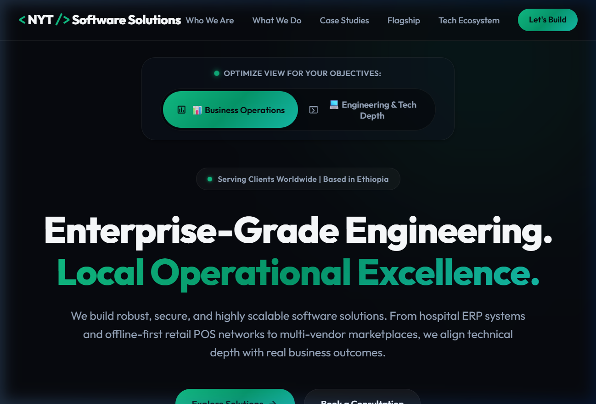
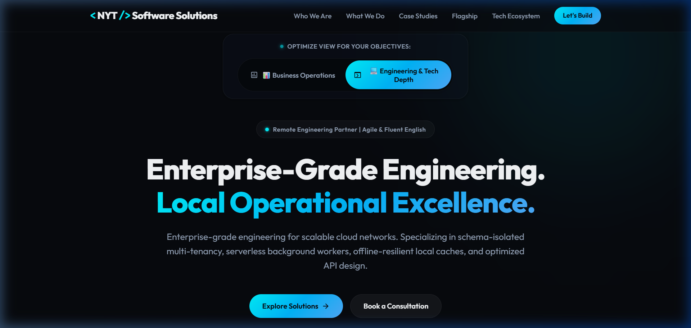
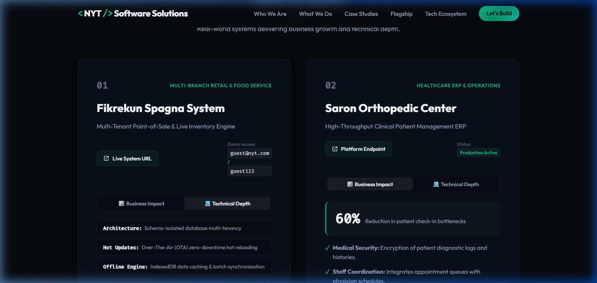
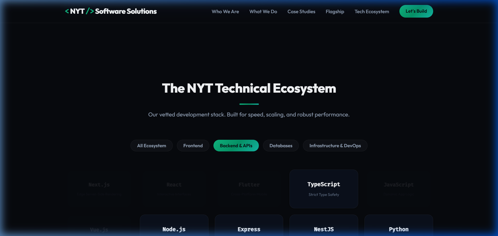
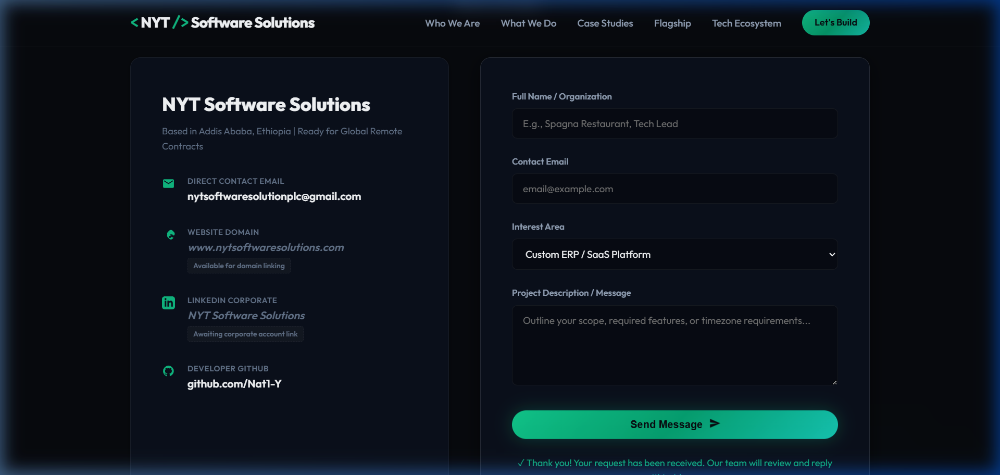

# Walkthrough - NYT Software Solutions Portfolio

This document provides a summary of the design architecture, core code files, and verified interactions for the official **NYT Software Solutions** company portfolio.

---

## 🛠️ Summary of Files

The repository consists of:
1. **`index.html`**: The semantic document layout containing the responsive wrapper structures, active link pathways, guest credentials, form bindings, and SEO elements.
2. **`styles.css`**: The core styling layout managing variables, interactive mode themes (Business vs Tech), dynamic background glow, grid configurations, and media query break-points.
3. **`app.js`**: The script controlling page-level state management, perspective triggers, inner card tab routing, stack selection filtering, and mock form pipeline feedbacks.

---

## 📸 Design Showcase & Interactive Demos

Here is the visual demonstration of how the page behaves when users toggle perspectives, filters, or submit requests.

````carousel

<!-- slide -->

<!-- slide -->

<!-- slide -->

<!-- slide -->

````

### 📹 Full Interactive Session Recording
Watch the full workflow showing perspective transitions, filtering, and form submission in the browser:


---

## 🔍 Verification & Test Results

### 1. Global Perspective Switcher
- **Tested**: Clicking between `📊 Business Operations` and `💻 Engineering & Tech Depth` at the top of the page.
- **Results**:
  - The CSS theme colors dynamically transition (emerald green for Business, bright cyan for Tech).
  - The hero subtitle smoothly swaps copy: Business highlights custom ERPs and POS networks; Tech details schema isolation, background workers, and REST API structures.
  - The floating badge swaps from *"Serving Clients Worldwide | Based in Ethiopia"* to *"Remote Engineering Partner | Agile & Fluent English"*.
  - Every project card on the page aligns its tab content to match the global selection automatically.

### 2. Case Study Card Inner Switcher
- **Tested**: Manually clicking `Technical Depth` or `Business Impact` tabs inside the Fikrekun Spagna System card.
- **Results**:
  - Changes the content area locally for that card without affecting other projects.
  - Correctly shows local metrics and business bullet points in business mode, and database schema / update architecture specs in technical mode.

### 3. Tech Stack Filtering
- **Tested**: Selecting categories like `Frontend`, `Backend & APIs`, `Databases` or `Infrastructure`.
- **Results**:
  - Unselected cards fade out and scale down smoothly while matching tech stack elements remain highlighted and fully visible.

### 4. Consultations Contact Form
- **Tested**: Entering name, email, interest, and messaging variables, and submitting.
- **Results**:
  - The submit button enters a premium "Sending..." state with an automated spinner.
  - Correctly validates fields, fires a simulated async call, clears form inputs, and renders a persistent checkmark status message: *"✓ Thank you! Your request has been received. Our team will review and reply within 4 hours."*
